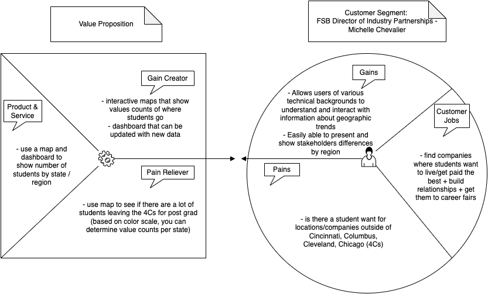

```{r setup, include=FALSE}
knitr::opts_chunk$set(echo = TRUE,message=FALSE,warning=FALSE)

#package intialization
rm(list = ls()) # clear global environment
graphics.off() # close all graphics
if(require(pacman)==FALSE) install.packages("pacman")
pacman::p_load(DataExplorer,tidyverse,readxl,zoo,stargazer,kableExtra,skimr,plotly,ggpubr,vtable,tm)
```

# Introduction and Purpose

Molly Wimer and Elijah Weaver's Business Value Proposition for dealing with geographic tend problems. 



# Data Sources

Write something here

## Read in the data

```{r}
data=readRDS(file = "FSB_BI_Survey_2019_2021.rds")
```

# Data Preprocessing

Describing each data preprocessing step with small chunks of code, output where necessary, and documentation

```{r}
state_mapping <- list(
    oh = 'OH',
    ohio = 'OH',
    'ohio / usa' = 'OH',
    ny = 'NY',
    ga = 'GA',
    il = 'IL',
    ca = 'CA',
    ks = 'KS',
    'new york' = 'NY',
    mn = 'MN',
    nc = 'NC',
    ky = 'KY',
    tx = 'TX',
    'oh, usa' = 'OH',
    illinois = 'IL',
    'd.c.' = 'DC',
    nv = 'NV',
    in = 'IN',
    wi = 'WI',
    ma = 'MA',
    'michigan, detroit' = 'MI',
    co = 'CO',
    indiana = 'IN',
    minnesota = 'MN',
    wa = 'WA',
    'washington d.c/united states' = 'DC',
    nj = 'NJ',
    ut = 'UT',
    mo = 'MO',
    mi = 'MI',
    ia = 'IA',
    pennsylvania = 'PA',
    remote = 'Remote',
    oh = 'OH',
    'il/usa' = 'IL',
    pa = 'PA',
    'ohio/usa' = 'OH',
    'north carolina' = 'NC',
    washington = 'WA',
    va = 'VA',
    il = 'IL',
    ri = 'RI',
    az = 'AZ',
    'georgia, usa' = 'GA',
    me = 'ME',
    ct = 'CT',
    'massachusetts, usa' = 'MA',
    md = 'MD',
    'tba / usa' = 'TBA',
    florida = 'FL',
    'fujian province' = 'Fujian',
    california = 'CA',
    michigan = 'MI',
    'ohio/united states' = 'OH',
    wisconsin = 'WI',
    'illinois / usa' = 'IL',
    tn = 'TN',
    montana = 'MT',
    'mi / u.s.' = 'MI',
    kansas = 'KS',
    na = 'N/A',
    'ohio / the united states' = 'OH',
    georgia = 'GA',
    'new york' = 'NY',
    'il, usa' = 'IL',
    tbd = 'TBD',
    'oh/us' = 'OH',
    ar = 'AR',
    'virginia/ usa' = 'VA',
    texas = 'TX',
    'virginia (va)' = 'VA',
    india = 'India',
    'rhode island' = 'RI',
    'ohio/ united states' = 'OH',
    ohio = 'OH',
    'il, united states' = 'IL',
    'oh/usa' = 'OH',
    'illinois/ us' = 'IL',
    kentucky = 'KY',
    china = 'China',
    'illinois/usa' = 'IL',
    fl = 'FL',
    'illinois, usa' = 'IL',
    oregon = 'OR',
    ms = 'MS',
    illinois = 'IL',
    'ohio, usa' = 'OH',
    usa = 'USA',
    dc = 'DC',
    la = 'LA',
    delaware = 'DE',
    'il, us' = 'IL',
    colorado = 'CO',
    il = 'IL',
    'texas/ usa' = 'TX',
    connecticut = 'CT',
    'ohio / united states' = 'OH',
    ohio = 'OH',
    sc = 'SC',
    tennessee = 'TN',
    'n/a' = 'N/A',
    montenegro = 'Montenegro',
    belize = 'Belize',
    ireland = 'Ireland',
    'na' = 'N/A',
    nh = 'NH',
    'district of columbia' = 'DC',
    us = 'USA',
    canada = 'Canada',
    'new york, usa' = 'NY',
    'tx/usa' = 'TX',
    'il/ usa' = 'IL',
    ne = 'NE',
    'new york' = 'NY',
    'nan' = 'N/A',
    'in / usa' = 'IN',
    'wisconsin / usa' = 'WI',
    'ma / usa' = 'MA',
    'virginia' = 'VA',
    'colorado/ united states' = 'CO')

# Function to standardize state names
standardize_state_name <- function(state_name) {
  if (!is.na(state_name) && is.character(state_name)) {
    lower_state_name <- tolower(state_name)
    standardized_state <- state_mapping[[lower_state_name]]
    
    if (!is.null(standardized_state)) {
      return(standardized_state)
    }
  }
  
  return(state_name)  # Return the input state_name as is
}


standardized_states <- sapply(states, standardize_state_name)
```

# The rest of your document

Add sections and subsections as necessary to guide your analysis
