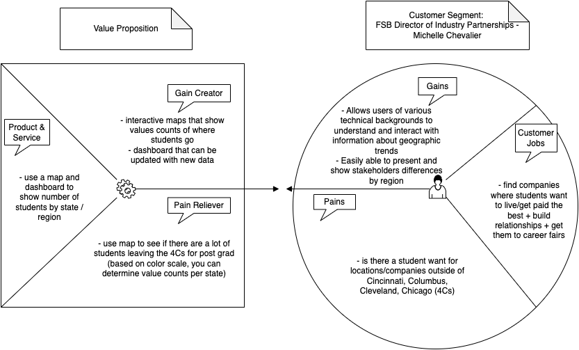

```{r setup, include=FALSE}
knitr::opts_chunk$set(echo = TRUE,message=FALSE,warning=FALSE)

#package intialization
rm(list = ls()) # clear global environment
graphics.off() # close all graphics
if(require(pacman)==FALSE) install.packages("pacman")
pacman::p_load(DataExplorer,tidyverse,readxl,zoo,stargazer,kableExtra,skimr,plotly,ggpubr,vtable,tm)
```
# Description of the Audience and Purpose of your Project

Our audience is Michelle Chevalier, the Farmer School of Business Director of Industry Partnerships. In the Farmer School of Business, a large emphasis is put on students getting jobs in "The Four C's" - Cincinnati, Columbus, Cleveland, and Chicago. Through our analysis, we want to see if students are getting a lot of jobs outside of the 4 C's. If we find that this is the case, this will change Michelle's role. She will expand her corporate partnership outside the 4 C's and try to connect with companies in other populated cities with Miami graduates. Once she determines which states are the most popular outside of the 4 C's, she will try to get some of these companies to come to career fair, have a presence on Handshake, and network with students. This project will help students who do not want to work in the 4 C's and help FSB faculty to provide company partnerships where there is student need.

# Introduction and Purpose

We took on the first prompt "Geographic trends". We are trying to predict where students might want to move in the future based on where students have gone in the past based on graduates from 2019 to 2021. We will look at the value counts of each state to determine where most students are going. In order to create these insights, we will need to create a chloropleth. Our product will be intuitive for users of any background to understand. Our goal is to use the past data to create insights that can be applied to future graduating classes and have stronger prediction abilities. 



# Data Sources

**Description of the Data**

This data was entered by students, meaning that there are many inconsistencies with the way that the data was entered. For example, for job location of Cincinnati, the students could enter "Cincinnati, OH" or "cincinnati" or "Cincinnati, OH, USA". There are several variables that are incorrectly coded like year, gender, GPA range, race, survey_pref, location_pref, field_pref. In order to get meaning from these variables, they need to be manipulated before analyzing. There are 3235 total observations in the dataset. 

You have three years of data representing FSB graduates, including graduates in 2019, 2020, and 2021. The dataset provided had 42 variables. The source is either derived by me during data cleaning/merging, from the Oracle Business Intelligence Enterprise Edition (OBIEE) maintained by Miami adminsitration, or from the self reported senior survey. I have cleaned and merged the files into one file.

nmajor: numeric,derived, the number of majors
major1: text, OBIEE, first major
major 2: text, OBIEE, second major
BBRJ: binary, OBIEE, an attribute of a student, but we do not know what this stands for
Business Direct Admit: binary, OBIEE, a direct admit to FSB as a first year
Combined Cacc and Masters: binary, OBIEE, combined degree student
Dean's List: binary, OBIEE, achieve dean's list status at least once
First Generation College Stdnt: binary, OBIEE, first generation student status
FSB Scholars: binary, OBIEE, FSB scholars program
Honors Program: binary, OBIEE, member of University honors program
President's list: binary, OBIEE, achieved president's list at least once
Study Abroud Courtesy Account: binary, OBIEE, do not know meaning
Transfer Work: binary, OBIEE, do not know exact meaning
Cum Laude: binary, OBIEE, graduated Cum Laude
Magna Cum Laude: binary, OBIEE, graduated Magna Cum Laude
Summa Cum Laude: binary, OBIEE, graduated Summa Cum Laude
University Honors: binary, OBIEE, graduated with University Honors
University Honors w/Distinction: binary, OBIEE, graduated with University Honors with Distinction
minor1: text, OBIEE, first listed minor
minor2: text, OBIEE, second listed minor
IPEDS.Race.Ethnicity: text, OBIEE, race/ethnicity
Gender: text, OBIEE, sex
GPA.Range: text, OBIEE, GPA within a .5 range
Term.Code: numberic, OBIEE, First four digits are the physcal year (beginning in July, e.g. July 2020 is FY 2021). Last two digits is the term (10=fall, 15=winter, 20=spring, 30=summer).
Year.x: text, derived, first four digits of Term.Code stored as a character variable
latin_honors: text, survey, latin honors designation
survey_city: text, survey, student reported city in which their job is located
survey_company: text, survey, student reported company in which they accepted a job
survey_deptfunc: text, survey, student reported job function
survey_gradprogram: text, survey, student reported graduate program they will be attending
survey_gradschool: text, survey, stuent reported graduate school they will be attending
survey_internfour: text, survey, student reported fourth internship they held during college
survey_internthree: text, survey, student reported third internship they held during college
survey_interntwo: text, survey, student reported second internship they held during college
survey_internone: text, survey, student reported first internship they held during college
Survey_internships: text, survey, Student reported number of internships they held during college
survey_offers: text, survey, student reported number of offers for full time employment received
survey_plans: text, survey, student reported plans after graduation
survey_pref_field: text, survey, student reported whether working in preferred field
survey_pref_loc: text, survey, student reported whether working in preferred location
survey_salary: numeric, survey, student reported salary
survey_state: text, survey, student reported state in which job is located

## Read in the data

```{r}
data=readRDS(file = "FSB_BI_Survey_2019_2021.rds")
```

# Data Preprocessing

Describing each data preprocessing step with small chunks of code, output where necessary, and documentation

```{r}
state_mapping <- c(
    'oh' = 'OH',
    'ohio' = 'OH',
    'ohio / usa' = 'OH',
    'ny' = 'NY',
    'ga' = 'GA',
    'il' = 'IL',
    'ca' = 'CA',
    'ks' = 'KS',
    'new york' = 'NY',
    'mn' = 'MN',
    'nc' = 'NC',
    'ky' = 'KY',
    'tx' = 'TX',
    'oh, usa' = 'OH',
    'illinois' = 'IL',
    'd.c.' = 'DC',
    'nv' = 'NV',
    'in' = 'IN',
    'wi' = 'WI',
    'ma' = 'MA',
    'michigan, detroit' = 'MI',
    'co' = 'CO',
    'indiana' = 'IN',
    'minnesota' = 'MN',
    'wa' = 'WA',
    'washington d.c/united states' = 'DC',
    'nj' = 'NJ',
    'ut' = 'UT',
    'mo' = 'MO',
    'mi' = 'MI',
    'ia' = 'IA',
    'pennsylvania' = 'PA',
    'remote' = 'Remote',
    'oh' = 'OH',
    'il/usa' = 'IL',
    'pa' = 'PA',
    'ohio/usa' = 'OH',
    'north carolina' = 'NC',
    'washington' = 'WA',
    'va' = 'VA',
    'il' = 'IL',
    'ri' = 'RI',
    'az' = 'AZ',
    'georgia, usa' = 'GA',
    'me' = 'ME',
    'ct' = 'CT',
    'massachusetts, usa' = 'MA',
    'md' = 'MD',
    'tba / usa' = 'TBA',
    'florida' = 'FL',
    'fujian province' = 'Fujian',
    'california' = 'CA',
    'michigan' = 'MI',
    'ohio/united states' = 'OH',
    'wisconsin' = 'WI',
    'illinois / usa' = 'IL',
    'tn' = 'TN',
    'montana' = 'MT',
    'mi / u.s.' = 'MI',
    'kansas' = 'KS',
    'na' = 'N/A',
    'ohio / the united states' = 'OH',
    'georgia' = 'GA',
    'new york' = 'NY',
    'il, usa' = 'IL',
    'tbd' = NA,
    'oh/us' = 'OH',
    'ar' = 'AR',
    'virginia/ usa' = 'VA',
    'texas' = 'TX',
    'virginia (va)' = 'VA',
    'india' = 'India',
    'rhode island' = 'RI',
    'ohio/ united states' = 'OH',
    'il, united states' = 'IL',
    'oh/usa' = 'OH',
    'illinois/ us' = 'IL',
    'kentucky' = 'KY',
    'china' = 'China',
    'illinois/usa' = 'IL',
    'fl' = 'FL',
    'illinois, usa' = 'IL',
    'oregon' = 'OR',
    'ms' = 'MS',
    'illinois' = 'IL',
    'ohio, usa' = 'OH',
    'usa' = 'USA',
    'dc' = 'DC',
    'la' = 'LA',
    'delaware' = 'DE',
    'il, us' = 'IL',
    'colorado' = 'CO',
    'il' = 'IL',
    'texas/ usa' = 'TX',
    'connecticut' = 'CT',
    'ohio / united states' = 'OH',
    'ohio' = 'OH',
    'sc' = 'SC',
    'tennessee' = 'TN',
    'n/a' = 'N/A',
    'montenegro' = 'Montenegro',
    'belize' = 'Belize',
    'ireland' = 'Ireland',
    'na' = 'N/A',
    'nh' = 'NH',
    'district of columbia' = 'DC',
    'us' = 'USA',
    'canada' = 'Canada',
    'new york, usa' = 'NY',
    'tx/usa' = 'TX',
    'il/ usa' = 'IL',
    'ne' = 'NE',
    'new york' = 'NY',
    'nan' = NA,
    'in / usa' = 'IN',
    'wisconsin / usa' = 'WI',
    'ma / usa' = "MA",
    'virginia' = "VA",
    'colorado/ united states' = 'CO',
    'nebraska' = "NE",
    'maine' = "ME",
    'united states' = 'USA',
    'zhejiang province' = 'China'
)

undecided_values <- c(
  "Undecided",
  "Not sure, maybe NYU",
  "Not decided yet",
  "Unsure",
  "Not decided",
  "I haven't decided yet. :)",
  "No yet",
  "have not chosen yet",
  "not sure",
  "I haven't decided yet.",
  "not decided",
  "Not revive offers yet"
)

city_mapping <- c(
  "New york" = "New York City",
  "Witchita" = "Wichita",
  "new york" = "New York City",
  "Indianpolis" = "Indianapolis",
  "Washington, D.C" = "Washington",
  "Washington DC" = "Washington",
  "Washington, D.C." = "Washington",
  "Washington D.C" = "Washington",
  "New York CIty" = "New York",
  "Cincinatti" = "Cincinnati",
  "Findlay (Tentative)" = "Findlay",
  "Cincinnnati" = "Cincinnati",
  "Philadephia" = "Philadelphia",
  "cleveland" = "Cleveland",
  "chicago" = "Chicago",
  "Sylvania" = "Sylvania",
  "Forth Worth" = "Fort Worth",
  "Fort Lauderdale" = "Fort Lauderdale",
  "Fort Myers" = "Fort Myers",
  "Ft Myers" = "Fort Myers",
  "NYC" = "New York City",
  "Mt. Healthy" = "Mt. Healthy",
  "Philadephia" = "Philadelphia",
  "Ft. Myers" = "Fort Myers",
  "Cincinnati, OH" = "Cincinnati",
  "boston" = "Boston",
  "Brooklyn" = "New York City",
  "Brooklyn Heights" = "New York City",
  "Manhattan" = "New York City",
  "North Canton, Ohio" = "North Canton",
  "Westerville (Columbus)" = "Westerville",
  "Chandler, AZ" = "Chandler",
  "To Be Determined" = NA,
  "Blue ash" = "Blue Ash",
  "Not Available" = NA,
  "Springfield, OH" = "Springfield",
  "Various" = NA,
  "August" = "Augusta",
  "CLEVELAND" = "Cleveland",
  "Colubmus" = "Columbus",
  "Hamiliton" = "Hamilton",
  "Indiana" = "Indianapolis",
  "New York" = "New York City",
  "Washinton" = "Washington",
  "na" = NA,
  "nan" = NA,
  "TBD" = NA,
  "Don't Know Yet" = NA,
  "N/A" = NA
)

honors_levels <- c("Cum laude", "Summa Cum Laude", "Magna Cum Laude")
```

Utilizing the mapping lists and tidyverse code to mutate, standardize, and clean the data

```{r}
data <- data %>%
  #formalizing the state column to be standardized
  mutate(survey_state = ifelse(tolower(survey_state) %in% names(state_mapping), state_mapping[tolower(survey_state)], survey_state)) %>% 
  # mutating all values that point to uncertainty or not knowing to be a single column called undecided
  mutate(survey_gradschool = ifelse(survey_gradschool %in% undecided_values, "Undecided", survey_gradschool)) %>%
  # Map the city column the same way as the state column
  mutate(survey_city = ifelse(survey_city %in% names(city_mapping), city_mapping[(survey_city)], survey_city)) %>% 
  #Getting rid of values that are not condusive with the column and making it an integer
  mutate(survey_offers = ifelse(survey_offers %in% c("multiple", "an","2+"), NA, as.integer(survey_offers))) %>% 
  #Getting rid of values that are not condusive with the column and making it an integer
  mutate(survey_internships = ifelse(survey_internships %in% c("RPT", "N/A"), NA, as.integer(survey_internships))) %>% 
  # Turns survey pref location into a binary indecator
  mutate(survey_pref_loc = as.numeric(ifelse(survey_pref_loc == "Yes", 1, ifelse(survey_pref_loc == "No", 0, NA)))) %>%
  # turns pref field into a binary indicator
  mutate(survey_pref_field = as.numeric(ifelse(survey_pref_field == "Yes", 1, ifelse(survey_pref_field == "No", 0, NA)))) %>%
  # makes the altin honors valriable a factor
  mutate(latin_honors = factor(latin_honors, levels = honors_levels)) %>% 
  # makes gender a factor
  mutate(Gender = factor(Gender)) %>% 
  # Making Race Ethnicity a factor as its fixed values
  mutate(IPEDS.Race.Ethnicity = factor(IPEDS.Race.Ethnicity)) %>% 
  # Doing the same with year
  mutate(year.x = factor(year.x)) %>% 
  # Doing the same with GPS.Range
  mutate(GPA.Range = factor(GPA.Range)) %>% 
  # Doing the same with survey plans
  mutate(survey_plans = factor(survey_plans)) %>% 
  # Getting rid of three variables that have no meaning per the data dictionary
  select(-BBRJ) %>% 
  select(-`Study Abroad Courtesy Account`) %>% 
  select(-`Transfer Work (Pre-Banner)`)
```

```{r}
df = write.csv(data, "616-CareerProj 2/data.csv", row.names=FALSE)
```

```{r}
#Summary statistics to get an easy overview of what the data looks like now
summary_data <- data.frame(
  DataType = sapply(data, class),
  NAs = sapply(data, function(x) sum(is.na(x)))
)

print(summary_data)
```

In our data cleaning process, we tackled various tasks to ensure our dataset was accurate and ready for analysis. One of the key aspects we addressed was the standardization of location data, particularly the 'survey_state' and 'survey_city' columns. We observed that there were issues like misspelled entries, inconsistent capitalization, or different formats used to represent the same places. To effectively understand where students are moving and seeking jobs, we needed a clean and uniform representation of these locations.

To achieve this, we developed a mapping list and applied it to correct all non-standard values. This made all entries consistent and allowed for easier analysis.

We applied a similar approach to the 'grad school' column, where we noticed multiple answers referencing 'undecided.' We standardized these entries to create a more consistent dataset.

For the 'internships' and 'offers' columns, we transformed the data into numeric values to ensure the correct data type. During this process, any values that were not numeric or were ambiguous were converted to 'n/a' to maintain data integrity.

Next, we reviewed the data types of various columns, such as 'latin_honors', 'years', 'gender', 'Race', 'survey_plans' ,'pref_field', and 'pref_loc'. We adjusted them to the appropriate data types to ensure accurate analysis. For most of the columns we transformed them to factors to allow for analyses on the categorical variable. 

Finally, we removed certain columns, namely 'BBRJ,' 'study abroad courtesy account,' and 'transfer work.' These columns were deemed to have no meaningful value according to the documentation and were therefore eliminated from our dataset.

# Computing Enviroment

```{r}
sessionInfo()
```
